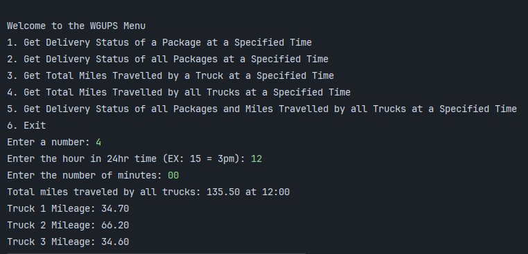

# Package Delivery Routing Simulator

A Python application that simulates and generates delivery routes under real-world constraints like deadlines, truck capacity, and multiple drivers using a heuristic/optimization approach.

## Overview

This tool models last-mile delivery logistics by computing feasible truck routes that satisfy constraints such as prioritized deadlines and capacity. It’s useful for understanding how algorithms behave with real constraints and for demonstrating practical optimization logic in Python.

## Tech Stack

- Python 3.13.3
- Standard library only (no external dependencies)
- Uses CSV input for address/distance matrices

## Installation

This project requires Python 3.13+. Clone the repo and run:
1. git clone https://github.com/MoToney/package_delivery_app.git
2. cd package_delivery_app
3. python3 -m venv venv
4. source venv/bin/activate
5. pip install -r requirements.txt # (if you generate one)

## Usage

Run the main entry point:
- python main.py

## Example

## Input Data

Place your distance matrix CSV in the `data/` folder:
- `distance.csv`: Contains driving distances between nodes
- `packages.csv`: Contains package ID, address, deadline, constraints

See `data/example.csv` for a template.

## Design

- The `main.py` script reads CSV files and constructs Trucks and Packages.
- A nearest-neighbor heuristic attempts to assign packages to trucks while observing constraints.
- Output summarizes routes and constraint satisfaction.
- Custom hashmap stores packages

## Limitations

- Uses a heuristic approach rather than exact VRP solver.
- Does not visualize routes.
- Assumes symmetric distances in the CSV.

## Future Work

- Add visualization for routes.
- Allow dynamic input through CLI flags.

## License

MIT License

## Contact

Maurice Toney Jr. – mauricetoneyjr@gmail.com

